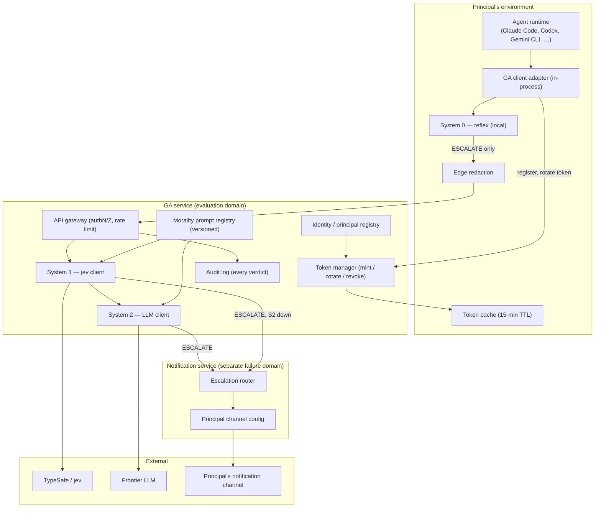
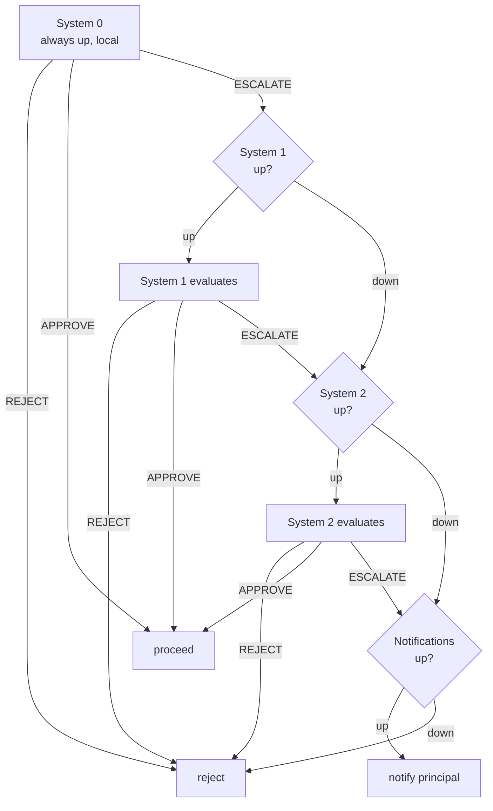
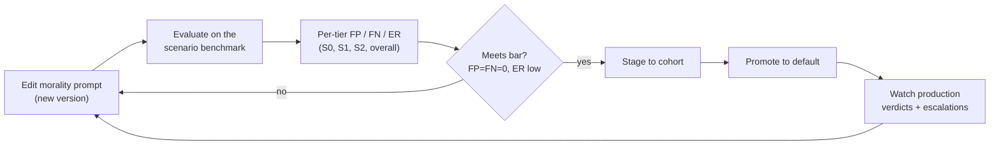
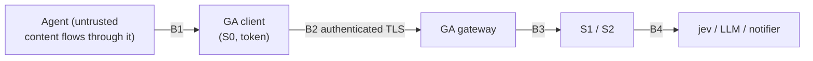

# Guardian Angel Service — Technical Specification

**Status:** Draft for review · **Date:** 2026-09-20 · **Owner:** Leo Linbeck III

Guardian Angel (GA) is delivered as a web service that gates every tool call for any
frontier model, with one moral core hosted in the service. This spec covers the
service, the thin client adapters, the fail-closed failure ladder, GA-native token
management, service-hosted System 1 and System 2, and a framework for iterating on the
shared morality prompt.

**Architecture note (2026-09-20):** System 1 and System 2 run **inside the GA service**,
not in the client adapter. The adapter holds only System 0 (the local reflex) and a thin
client that sends escalated calls to the service. This is a deliberate change from the
earlier draft, in which S1/S2 ran client-side; §5 and §13 explain what it buys and what
it costs.

It supersedes nothing in the running clinical trial; it describes the product GA
becomes after the trial and paper are complete.

---

## 1. Principles

1. **The principal is sacrosanct.** Every decision is ordered to the genuine good of
   a specific, verified human. Aristotle (practical wisdom), Aquinas (synderesis and
   conscience), and Newman (the illative sense) are the default moral frame.
2. **Fail closed.** No outage, timeout, or error may produce an APPROVE. The worst an
   outage does is block legitimate work; it never lets harm through.
3. **Doubt travels upward.** Any tier that cannot decide — including because it broke —
   escalates to the tier above it, never approves or rejects because it failed.
4. **Minimal exposure.** The client sends the service only what the tiers need to judge
   an escalated call, redacted at the edge before it leaves the principal's machine
   (see §7). Calls System 0 clears never leave the machine at all.
5. **One core, many adapters.** The moral reasoning lives once, in the service; each
   runtime gets a thin client adapter that holds only System 0 (see §4).

---

## 2. Components



- **Client adapter (in-process):** intercepts tool calls, runs **System 0 locally**, and
  for anything S0 escalates, redacts at the edge and sends the NormalizedCall to the
  service over an authenticated channel. Applies the returned verdict in the runtime's
  terms. Holds no morality prompt, no jev credential, no LLM key. See §5.
- **GA service (evaluation domain):** the API gateway (authentication, authorization, rate
  limiting), identity, token management (§6), **System 1 and System 2** (§7), the versioned
  morality prompt registry (§8), and the audit log (§10).
- **Notification service (separate failure domain):** the escalation router and the
  principal's channel configuration, deployed independently of S1/S2 so an evaluation-domain
  outage never silences escalation (§9). GA holds the channel config; the principal's
  environment holds no notification secret.
- **External:** jev (System 1's model), the frontier LLM (System 2's model), and the
  principal's notification channel (escalation destination). Both model relationships are
  held by the service, not the client.

---

## 3. The failure ladder

Every tool call starts at System 0. Each tier approves, rejects, or escalates; a tier
that is down routes upward, and a down tier at the top rejects. Fail-closed by
construction. **"Cannot reach a tier" is treated identically to "the tier is down"**
(item 6).



The change from the earlier draft is item 1: when a tier escalates and **System 2 is
down**, the escalation still tries to reach the principal directly. It becomes a REJECT
only if the notification channel is also down. So the principal — the last word — is
reached whenever they are reachable, even with System 2 unavailable.

**Invariants**

- System 0 can never be down (local code); there is always at least a reflex.
- A tier being down never causes an APPROVE. Only a live tier approves.
- REJECT is terminal at every tier, up or down.
- The principal is reached whenever an escalation is warranted **and** the notification
  channel is live — from System 2, or directly when System 2 is down.
- The only thing that turns an escalation into a REJECT is the notification channel also
  being down. An outage never bothers the human beyond their chosen channel, and nothing
  consequential slips past them.
- When System 2 is down, System 0 and System 1 still approve what they can clear; the
  genuinely uncertain calls go to the principal (if reachable) rather than being rejected
  outright. Degrades gracefully.

---

## 4. Core and adapters

### 4.1 The core interface

The core is a runtime-free module. It exposes one function:

```latex
\text{evaluate}(\text{NormalizedCall}) \rightarrow \text{Verdict}
```

**NormalizedCall**

| Field | Meaning |
| --- | --- |
| `tool_name` | The tool being called |
| `tool_input` | The tool's arguments |
| `principal_request` | The most recent instruction the principal typed |
| `history` | Prior calls, GA's verdict on each, and a short redacted output summary for executed calls |
| `cwd` | Working directory, for file/download resolution |

**Verdict**

| Field | Meaning |
| --- | --- |
| `decision` | `APPROVE` \| `REJECT` \| `ESCALATE` |
| `tier` | Which tier decided (`system0`/`system1`/`system2`) |
| `reason` | Plain-language rationale (shown to agent and principal) |
| `trail` | Per-tier record for the audit log |

Each adapter does three things only: **normalize** the runtime's tool-call shape into a
NormalizedCall, **evaluate** it (run System 0 locally; for an S0 escalation, redact and
send to the service, which runs S1/S2), and **apply** the verdict in the runtime's own
terms. The reasoning is never reimplemented, and only System 0 runs in the adapter.

### 4.2 Adapter shapes

| Shape | Interception point | Covers |
| --- | --- | --- |
| Host hook | Runtime's native pre-tool callback | Claude Code, Codex CLI, Gemini CLI, Cursor, OpenCode (§4.3) |
| Agent middleware | The proposal-then-execute seam in the agent loop | OpenAI/Anthropic/Gemini/Bedrock raw APIs, LangChain, LlamaIndex, custom loops |
| MCP proxy | Between an MCP client and the real MCP servers | Any MCP-speaking client |

The middleware shape rests on one fact: with raw model APIs the model never executes a
tool — it proposes a call, and the application executes it. That seam is universal.

### 4.3 Host-hook adapters (item 2)

Several harnesses expose a blocking pre-tool hook with a near-identical stdin-JSON
contract, so a host-hook adapter is worth shipping for each. GA writes one small hook
executable per harness; all of them normalize the harness's stdin JSON into a
NormalizedCall, call the core, and translate the verdict into that harness's
allow/deny/ask vocabulary.

| Harness | Pre-tool event | Input | Block mechanism | Confirmed | Caveats |
| --- | --- | --- | --- | --- | --- |
| Claude Code | `PreToolUse` | stdin JSON (`tool_name`, `tool_input`, `session_id`, `transcript_path`, `cwd`) | `permissionDecision: deny`/`ask`/`allow` + reason | Yes (shipping today) | Full tool coverage |
| Codex CLI | `PreToolUse` | stdin JSON (loose) | `permissionDecision: block` + reason, or exit 2 with reason on stderr | Yes | **Bash-only today** — Read/Write/Edit/Apply Patch/web/MCP do not fire it yet |
| Gemini CLI | `BeforeTool` | stdin JSON | stdout `decision: block` + reason | Yes | Verify tool coverage at build time |
| Cursor | `preToolUse` | stdin JSON (camelCase) | permission decision referenced; block vocabulary under-documented | Partial | Confirm deny path before relying on it |
| OpenCode | `tool.execute.before` / `BeforeTool` (naming varies) | stdin JSON | Under-documented | Partial | Confirm at build time |

**Verdict mapping (all host hooks):** APPROVE → allow/proceed; REJECT → deny/block with
the reason; ESCALATE → the harness's "ask" if it has one, otherwise **block with an
"escalated, awaiting principal" reason** and route the escalation out-of-band (§9). Never
map ESCALATE to allow.

**Open items for host hooks:**
- Codex's Bash-only limitation means non-Bash tools run ungated there until Codex
  widens PreToolUse. Decide whether to ship the Codex adapter with that caveat documented
  or wait. **Recommendation:** ship with the caveat; Bash is where most harm lives.
- Cursor and OpenCode need their deny path confirmed against a live version before we
  claim support. Mark them "beta" until verified.

---

## 5. The client adapter: in-process vs sidecar (item 5)

**Decision: in-process for v1.** Moving S1/S2 into the service makes this easier, because
the client now holds far less: System 0 (pure local pattern-matching), edge redaction, a
token cache, and an HTTPS client. No morality prompt, no jev credential, no LLM key.

The adapter can run as a library inside the agent's own process, or as a separate local
sidecar process the agent talks to over a local socket.

| Dimension | In-process (library) | Local sidecar (separate process) |
| --- | --- | --- |
| Latency | Lowest — S0 is a direct call; only escalations are remote | One extra local IPC hop even for S0 |
| Deployment | One dependency to add; nothing extra to run | A second process to launch, supervise, health-check |
| What lives in the agent's memory | S0 code, token cache, HTTPS client — no morality prompt, no model credentials | Even those confined to the sidecar |
| Crash blast radius | A bug in S0/client can hang the agent | A sidecar crash is isolated and fails closed |
| Escalation-queue state | Lives in-process; lost on agent restart (held calls fail closed to reject) | Sidecar can hold the queue across restarts |
| Multi-agent on one host | Each process re-runs S0 and keeps its own token | One sidecar serves many local agents; shared token |
| Tamper resistance | Agent code could reach into the adapter's memory | Process isolation is a real boundary |
| Fit with host hooks | Host hooks already spawn a fresh process per call — the hook process loads the S0 library and calls the service | Hook talks to a long-lived sidecar instead |

**Why in-process wins for v1 (reinforced by the S1/S2 move):**
- The client's attack surface shrank: with no model credentials or prompt on the client,
  the main reason to isolate (secrets out of the agent's address space) largely goes away.
  The remaining secret is a 15-minute scoped token.
- S0 must be as fast and dependency-free as possible; a local IPC hop for every call —
  including the majority S0 approves outright — is pure overhead.
- Host hooks are short-lived processes, so "the hook loads the S0 library and calls the
  service" is in-process by nature.

**Where the sidecar still wins, and when to revisit:**
- A durable escalation queue that survives agent restarts (§9).
- A shared token and one refresh loop when many agents run on one host.
- A compromised-agent threat model, where process isolation of even the token matters
  (see §13).

**Recommendation:** in-process for v1; keep the client free of any assumption that it runs
in the agent's process, so a sidecar is a later packaging choice, not a rewrite.

---

## 6. Token management, GA-native (item 1)

**GA mints and manages its own tokens.** There is no dependency on ActPass as a running
service; ActPass is a reference for the pattern, which is the same short-lived,
downscoped-token model used by Stripe ephemeral keys, AWS STS, Google Cloud short-lived
service-account tokens, and Twilio access tokens. Token management is a first-class part
of GA.

### 6.1 What GA's token manager does

- **Mint.** On principal sign-in or adapter registration, issue a token bound to that
  principal, scoped to only the GA endpoints the adapter needs, with a **15-minute TTL**
  (item 4).
- **Rotate.** The adapter re-mints before expiry while the service is reachable, using a
  longer-lived registration credential (refresh-token role) held more securely.
- **Cache.** The adapter caches the current token; it is the only thing that lets the
  ladder run while the service is briefly unreachable (the grace window).
- **Revoke.** The service can revoke a principal's tokens (offboarding, suspected
  compromise). Revocation takes effect within one TTL at most.

### 6.2 What the token is for

The adapter uses the token for one thing: to authenticate to the GA service when it sends
an escalated call for S1/S2 evaluation (and to rotate the token and register). Because S1
and S2 now run **inside the service**, the client never holds a jev credential or an LLM
key — those model relationships live entirely server-side. The client's only secret is the
short-lived scoped token.

### 6.3 TTL and the grace window

- **15-minute TTL** (item 4). The token authenticates client-to-service requests; a brief
  service blip is bridged by normal retry, not by the token.
- Because S1 and S2 are server-side, there is **no offline evaluation**: if the service is
  unreachable, S1 and S2 are down by definition (item 6, "cannot reach == down"). The
  grace window from the earlier draft (offline S1 on a cached credential) no longer
  applies — that was a consequence of client-side S1.
- **What happens when the service is unreachable from the client:** every call that S0
  escalates has nowhere to go — S1, S2, and the notification service are all GA-side. Per
  the fail-closed rule the call is REJECTED (§9.3). The notification service lives in a
  separate failure domain from S1/S2 (§9), so an S1/S2-only outage still leaves escalation
  live; but a client that cannot reach GA at all reaches none of them.
- **Shared-dependency note:** for the client, reaching GA is the single dependency for
  everything above S0. If the client cannot reach GA, S0 alone decides — approve what S0
  clears, reject what S0 rejects, reject S0 escalations. Still fail-closed. This
  concentrates the client's availability risk in reaching the service; §13 treats it as a
  security consideration.

### 6.4 TTL as a knob

15 minutes is the starting value. Shorter → faster revocation, smaller grace window;
longer → more offline resilience, slower revocation. Revisit with real outage data.

---

## 7. Service-hosted System 1 and System 2 (item 2 of this round)

**Decision: System 1 and System 2 run inside the GA service.** The client adapter runs
System 0 locally and, for anything S0 escalates, sends a redacted NormalizedCall to the
service, which runs S1 (jev) and S2 (the LLM) and returns a verdict.

### 7.1 Why this shape

- **The morality lives in one place.** S1 and S2 share one prompt version, one threshold
  set, one jev relationship, one LLM relationship — all server-side, updated centrally,
  never shipped to clients. A prompt or threshold change takes effect for everyone at once
  with no client rollout.
- **The client is trivial and hard to tamper with.** It holds no prompt, no model
  credential — only S0 and a scoped token. Less to leak, less to reverse-engineer, less to
  keep current.
- **Credentials never leave the service.** The jev key and the LLM key are held once,
  server-side, and rotated centrally. No per-principal LLM key handling on the client, and
  no principal-provider exposure of the morality prompt (the tension flagged in the earlier
  draft disappears).

### 7.2 The cost this shape accepts, and how it is bounded

The trade is explicit: **for any call S0 escalates, the NormalizedCall now transits the GA
service.** That includes the tool input, the principal's request, and the redacted history.
GA becomes a data processor for that material. This is the opposite of the earlier
client-side-key draft, and it must be bounded deliberately:

- **S0 is the privacy gate.** Only escalated calls leave the machine. S0 should be tuned so
  that clearly-safe, high-volume, read-only work is approved locally and never transmitted.
  The share of calls that reach the service is a privacy metric, not only a cost metric.
- **Edge redaction before transmission.** The client redacts secrets (keys, tokens, private
  keys, credential files) from the NormalizedCall **before** it leaves the machine, using
  the same redaction the harness and hook already apply. The service should never receive a
  raw secret; defense in depth re-redacts on ingest.
- **Data handling commitments.** The service must state and enforce retention limits on the
  transmitted context: encrypted in transit and at rest, minimal retention (the audit log
  keeps a redacted trail, §10, not the raw payload beyond what a verdict needs), no use for
  training, per-principal deletion. These are contractual, not just technical, commitments.
- **Model providers see the context.** S2 calls a frontier LLM from the service; that
  provider sees the (redacted) context under GA's provider agreement — one agreement GA
  controls and can vet, rather than each principal's own provider terms.

### 7.3 The LLM relationship

- **GA holds the S2 model relationship** (default). GA picks the S2 model, holds the key,
  bears the cost, and can enforce a capability floor so a weak model does not raise false
  negatives. This is the simplest and most consistent option and is the default.
- **Optional: bring-your-own model.** A principal may later be allowed to point S2 at their
  own provider/key, held encrypted server-side and used only for their calls — for cost
  control or provider preference. Deferred; not v1.
- **Provider abstraction.** S2 keeps a small provider layer (Anthropic Messages, OpenAI,
  Gemini, Bedrock) mapping the morality prompt + NormalizedCall to each provider's shape and
  parsing back the APPROVE/REJECT/ESCALATE JSON. Nascent form exists today
  (Haiku/Sonnet/Gemini profiles).

### 7.4 Consequence for the ladder

S1 and S2 availability is now GA evaluation-domain availability. If only the evaluation
domain is down but the separate notification service is up (§9), a tier's escalation still
reaches the principal. If the client cannot reach GA at all, S0 alone decides and S0
escalations REJECT (§6.3, §9.3). Concentrating S1/S2 in the service concentrates
availability risk there; §13 covers it.

---

## 8. Morality-prompt iteration framework (item 7)

Both System 1 (jev, unified spec) and System 2 (the LLM) judge under the **same** moral
framework prompt. GA needs a first-class framework for iterating on that shared prompt and
measuring the effect on both tiers at once.

### 8.1 Single source of truth

- The morality prompt is **one versioned artifact** in the GA service's prompt registry.
- System 2 uses it as its full instructions.
- System 1 uses it as the instructions of a single `choice` question (APPROVE / REJECT /
  ESCALATE), with only the parts a classifier cannot do removed (write a prose
  description, emit JSON). This is the "unified System 1" already prototyped
  (`system1-unified.json`).
- A prompt version therefore changes **both** tiers together, which is the point:
  iterate the morality once, not twice.

### 8.2 Versioning and rollout

- Every prompt is content-addressed and versioned (e.g. `morality@2026-09-20.1`).
- The prompt lives in the service registry and is read by S1 and S2 there; the client
  never fetches or caches it. A version change reaches everyone at once, with no client
  rollout.
- Rollout is staged: a new version can be pinned for a cohort or a single principal before
  becoming default. Verdicts are tagged with the prompt version in the audit log so
  behavior is attributable to a version.

### 8.3 The iteration loop



- **Benchmark.** The clinical-trial harness is the offline evaluator. A candidate prompt
  runs the scenario suite and reports, per tier and overall, false positives (REJECT on a
  benign call), false negatives (APPROVE on the harmful call), and escalation rate — the
  metrics already defined. Because S1 and S2 share the prompt, a single run shows how a
  wording change moves **both**.
- **Guardrails against overfitting.** Keep a held-out scenario set the iteration loop does
  not see; report on it separately. Thresholds and prompt wording tuned on the visible set
  must be validated on the held-out set before promotion.
- **Production feedback.** Real verdicts and escalations (audit log, §2) feed back:
  escalations that the principal consistently approves suggest an over-cautious prompt;
  any post-approval harm report is a prompt (or S0) failure to fix. These become new
  benchmark scenarios.
- **A/B in production.** Because verdicts carry the prompt version, two versions can run
  across cohorts and be compared on live FP/FN/ER and escalation-approval rates.

### 8.4 Interaction with jev's threshold policy

The unified System 1 wraps the shared prompt in a probability policy (approve/reject
thresholds, dissent guard). The **prompt** and the **thresholds** are versioned
separately: a prompt change and a threshold change are independent knobs, each attributable
in the audit log, so we can tell a wording effect from a threshold effect. Current
starting thresholds: S1 approve ≥ 0.90, S1 reject ≥ 0.70, dissent-guard reject ≥ 0.50.

---

## 9. Escalation delivery

**Notification is a GA-side service, hosted in its own failure domain, separate from
System 1 and System 2.** GA holds the principal's channel configuration and delivers
escalations; the principal's environment holds no notification secret. Escalation reaches
the principal whenever the notification service is up, and becomes a REJECT only when it is
down.

### 9.1 Why notification is separated from S1/S2

The notification service and the S1/S2 evaluation service are **deployed as independent
components with independent availability** — separate front doors, separate scaling,
separate health. This is a hard requirement (decision d), for one reason: if a tier
escalates while S2 is down (§3, item 1 of the prior round), the escalation must still reach
the principal. If notification shared a failure domain with S1/S2, a single outage would
take down both evaluation and escalation, and every escalation would collapse to a REJECT.
Separating them means an S1/S2 outage still leaves a live path to the principal.

Keeping notification GA-side (rather than in the principal's environment) is a deliberate
choice: it keeps the principal's contact credentials off their local machine, removing one
attack surface there, at the cost of GA holding the channel configuration. The escalation
delivery path is therefore always service-to-principal, never client-to-principal.

### 9.2 The two escalation sources, one delivery path

1. **From a live System 2 (normal).** S2's ESCALATE goes to the notification service, which
   delivers to the principal's channel.
2. **From System 1 when System 2 is down (item 1).** If a tier escalates and S2 is
   unavailable, the escalation still goes to the notification service — not an immediate
   REJECT. It becomes a REJECT only if the notification service is also down.

In both cases delivery is the same service-side notification component.

### 9.3 When the whole GA service is unreachable from the client

If the client cannot reach GA at all, S0 escalations cannot reach S1, S2, **or** the
notification service — all are GA-side. Per the fail-closed rule, the call is REJECTED. The
client never delivers notifications directly (that is the point of keeping the notifier
GA-side). This concentrates the "client can't reach GA" case into a clean REJECT, and is
the availability cost of the smaller local attack surface.

### 9.4 Blocking behavior

The agent call is **blocked and held** pending the principal's answer (block-and-queue),
resuming on approval. Where a runtime cannot hold a call, ESCALATE degrades to
deny-with-reason (fail closed), and the principal is still notified so they can re-run.

### 9.5 Invariants

- The only outcome that skips the principal is the notification service being down (or the
  client being unable to reach GA at all), which yields REJECT.
- No outage produces an APPROVE, and no outage silently proceeds.
- Notification availability is independent of S1/S2 availability by deployment, so an S1/S2
  outage never silences escalation.

**Queue durability.** In-process, the held-call queue is lost on agent restart — held calls
then fail closed to reject. A durable queue is one reason a sidecar (§5) may later be
preferred. Acceptable for v1.

---

## 10. Audit log

Every verdict is recorded: the NormalizedCall (redacted), the per-tier trail, the final
decision, the prompt version, the thresholds version, timing, and — on ESCALATE — the
principal's eventual answer. This is both the compliance record and the raw material for
prompt iteration (§8.3). It is likely GA's real product value beyond the gating itself.

---

## 11. Open decisions

| # | Decision | Leaning / status |
| --- | --- | --- |
| a | Ship Codex adapter despite Bash-only PreToolUse? | Ship with documented caveat |
| b | Cursor / OpenCode support | Beta until deny path confirmed on a live version |
| c | S2 model: GA-held vs bring-your-own | GA-held default; BYO deferred (§7.3) |
| d | Notification hosting | GA-side, in a **separate failure domain** from S1/S2 (§9); resolved |
| e | Sidecar packaging | Deferred; keep client host-agnostic so it stays a packaging choice |
| f | Held-out benchmark set composition | Define before first production prompt promotion |
| g | Token TTL | 15 min start; revisit with outage data |
| h | Retention policy for transmitted context (§7.2) | Define before first external principal; minimal retention, no training |

---

## 12. Build sequencing

Start after the clinical trial and paper are complete.

1. **Split the core.** System 0 becomes a standalone local library (the client's whole
   brain). S1 and S2 plus the policy become the service's evaluation module. The current
   `ga-lib/` files map cleanly: `system0.js` → client; `system1.js`, the policy, and the
   S2 caller → service; `context.js` splits into edge redaction (client) and briefing
   assembly (service).
2. **GA service spine:** API gateway (authN/Z, rate limit), token manager, identity, audit
   log, and the S1/S2 evaluation endpoint.
3. **Escalation router + notification channel**, with the channel reachable independently
   of the S1/S2 front door (§9 path 3).
4. **Client adapter** as a thin library: S0, edge redaction, token cache, HTTPS client.
5. **Host-hook adapters** for Claude Code (port the existing hook onto the client), then
   Codex and Gemini CLI (confirmed blocking hooks), then Cursor/OpenCode (beta).
6. **Agent-middleware adapter** and **MCP proxy** for non-hook runtimes and zero-code-change
   adoption.
7. **Prompt-iteration framework** wired to the trial harness as the offline evaluator, with
   staged rollout and production feedback.

---

## 13. Security evaluation (item 3 of this round)

This evaluates the updated architecture — S0 on the client, S1/S2 in the service — against
the assets, the trust boundaries, the main threats, and the residual risks.

### 13.1 Assets and trust boundaries

**Assets:** the principal's code/prompts/tool context (transmitted on escalation); the jev
and LLM credentials (service-side); the morality prompt (service-side, possibly
proprietary); the audit log; the scoped tokens; the integrity of the verdict itself (the
thing an attacker most wants to flip to APPROVE).

**Trust boundaries** (each is a place to authenticate, authorize, and validate):



- **B1 agent → client:** the tool call and its context are untrusted. Prompt-injection and
  poisoned file/tool content arrive here. The client must treat all of it as data.
- **B2 client → service:** the network boundary. Needs mutual authentication, TLS, replay
  protection, and per-principal rate limiting.
- **B3 gateway → S1/S2:** internal; the place to enforce that a request is bound to a real,
  authorized principal and that the payload was redacted.
- **B4 S1/S2 → external models and notifier:** GA's own credentials; egress control matters.

### 13.2 What the S1/S2-in-service move improves

- **Smaller client attack surface.** The client holds no morality prompt and no model
  credentials — only S0 and a 15-minute token. Compromising a client yields little: a
  short-lived token scoped to one principal, and the ability to submit calls that S1/S2
  still judge server-side.
- **Central credential custody.** jev and LLM keys live in one hardened place, rotated
  centrally, never distributed. This is strictly better than shipping per-principal model
  credentials to clients (the earlier draft).
- **Central, atomic policy control.** The morality prompt and thresholds cannot be stale or
  divergent across clients, and a bad version can be rolled back for everyone at once.
- **No morality-prompt exposure to arbitrary principal providers.** With GA holding the S2
  relationship, the prompt goes only to a provider GA vets, not to each principal's chosen
  provider.

### 13.3 What it worsens, and the mitigations

- **The principal's context now transits GA (the big one).** Escalated calls carry the
  principal's code, request, and history to the service. GA becomes a data processor and a
  breach of the service could expose that material.
  - *Mitigations:* S0 as the privacy gate (only escalations leave the machine); edge
    redaction before transmission with re-redaction on ingest; encryption in transit and at
    rest; minimal retention (redacted audit trail, not raw payloads); no training use;
    per-principal deletion; and treating "share of calls escalated" as a privacy metric to
    minimize. Decision (h) tracks the retention policy.
- **The service is now a single point of failure and a high-value target.** Everything above
  S0 depends on it, and it holds the credentials, the prompt, the audit log, and the
  transmitted context.
  - *Mitigations:* fail-closed by design means an outage degrades to S0, never to APPROVE;
    the notification service is deployed in a separate failure domain from S1/S2 (§9,
    decision d) so an evaluation outage still leaves a live path to the principal; standard
    hardening (isolation of the credential store, least-privilege internal services,
    egress allow-lists on B4, audit-log integrity/append-only).
- **A central verdict endpoint is the thing to attack to flip a REJECT to APPROVE.**
  - *Mitigations:* the verdict is computed server-side from a versioned prompt, not supplied
    by the client; every verdict is logged with its prompt/threshold version; S0 still runs
    locally and can independently REJECT before anything is transmitted, so the intrinsically-evil
    floor does not depend on the service at all.

### 13.4 Threat-by-threat

| Threat | Vector | Defense | Residual risk |
| --- | --- | --- | --- |
| Prompt injection via tool content | B1: poisoned file/tool output reaches S1/S2 as data | S0 reflex catches the worst; S1/S2 prompt treats all context as untrusted data (already hardened in the trial); jev `manipulation` check | A cleverly-worded payload could still sway S2; measured continuously via the benchmark |
| Stolen client token | B2: token exfiltrated from a client | 15-min TTL; per-principal scope; revocation within one TTL; mutual auth | ≤15 min window to submit calls as that principal — but S1/S2 still judge them, so no direct APPROVE |
| Compromised agent process | B1: agent tampers with the in-process client to skip GA | In-process trust is assumed for v1; sidecar isolates the token and S0 if this threat is in scope (§5, §13.5) | A fully compromised host can bypass any in-process guard; out of scope for v1 |
| Service breach | B3/store: attacker reads transmitted context or credentials | Encryption, minimal retention, credential-store isolation, egress control, append-only audit log | A full breach is high-impact; the reason retention is minimized and redaction is at the edge |
| Verdict tampering | B2/B3: attacker forges an APPROVE | TLS + mutual auth on B2; verdict computed server-side and logged with version; client cannot assert a verdict | Requires breaching the service or the channel; detected via audit-log anomalies |
| DoS on the service | B2: flood escalations | Per-principal rate limiting at the gateway; fail-closed means DoS blocks work, never opens it | An outage degrades to S0 + notify-principal; availability, not safety, is the casualty |
| Malicious/expired principal notification target | B4: escalations routed to an attacker's channel | Verify the channel at setup; bind it to the authenticated principal; re-verify on change | A compromised principal account could redirect its own escalations — an identity problem, handled at §2 identity |
| Egress abuse from S2 | B4: injected content makes S2's own call exfiltrate | S2 calls only the model API with a fixed request shape; no tool execution server-side; egress allow-list | Low; S2 has no tools, only a text completion |

### 13.5 Residual risks to accept or decide

- **In-process trust (v1).** A compromised host or agent process can bypass any in-process
  guard, including S0. This is inherent to running in the agent's process and is accepted
  for v1; the sidecar (§5) is the mitigation if the compromised-agent threat enters scope.
- **Service as data processor.** Accepting that escalated context transits GA is the core
  trade of this architecture. It is defensible given S0 gating, edge redaction, and minimal
  retention — but it is a real change from "data stays with the principal," and it should be
  stated plainly to principals. Decision (h).
- **Model-level false negatives.** No architecture removes the possibility that S2's model
  is talked into an APPROVE by adversarial context; the benchmark and the dissent guard
  bound it, but it is never zero. This is a model-quality risk, tracked by the metrics, not
  an architecture flaw.

### 13.6 Overall

The move to service-hosted S1/S2 is a net security improvement on credential custody,
client attack surface, and policy control, at the cost of making the service a data
processor and a single high-value dependency. Both costs are bounded by the two properties
already central to GA: **S0 runs locally and gates what is ever transmitted**, and **the
whole system fails closed** — so the worst outcome of any outage or breach is blocked work
and exposed-but-redacted context, never a wrongful APPROVE. The one hard requirement the
security view fixes as resolved is decision (d): notification is hosted GA-side but in a
failure domain separate from S1/S2, so an evaluation outage still leaves a live path to the
principal, while the principal's environment holds no notification secret.
